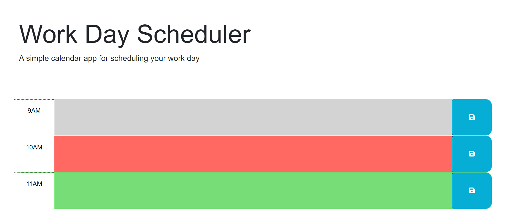

# challenge5-workDayScheduler

## Description

The motivation for the project was to modify code and create a work day scheduling application.
This project was undertaken to better learn API's and how they interact can dynamically work with JavaScript and css.
The updated codebase shows a planer that will show the days events, can store the information locally, and for each hour time block, shows a color representing the past present, or future.
Through this project a better understanding of dynamic uses JavaScript, CSS, and APIs was learned along with how each of the components interact with each other.

## Screenshot

## Webpage

[Link to published Work Day Scheduler](https://solomon-coding.github.io/challenge5-workDayScheduler/)

## Credits

`GoFullPage` extension was used to to take a screenshot of the webpage.

## License

None